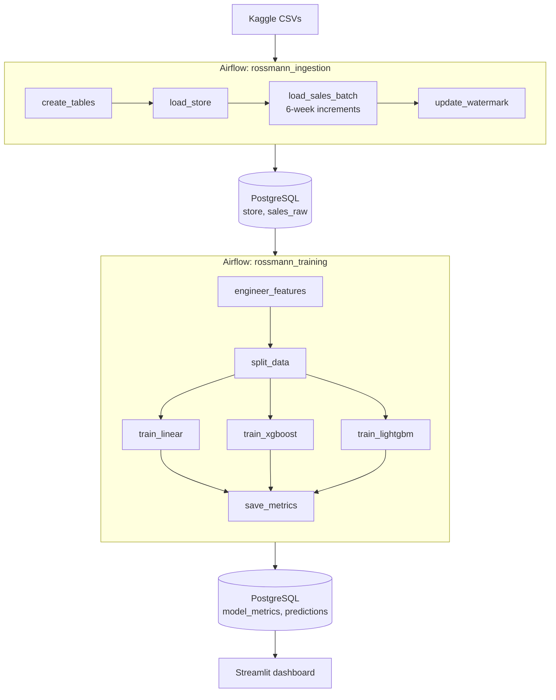
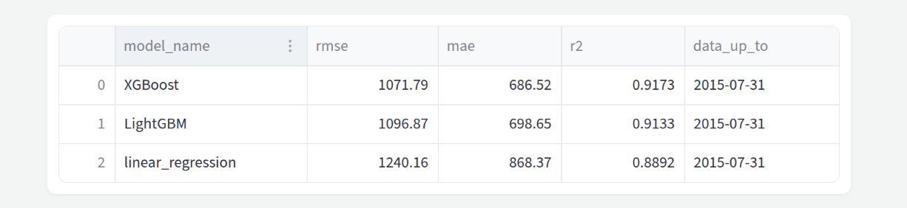
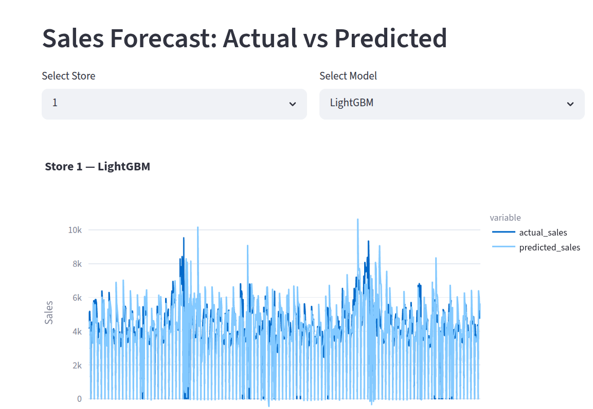

# Rossmann Sales Forecasting : MLOps Pipeline


This is an end-to-end MLOps pipeline for forecasting Rossmann store sales, built with Airflow, Docker, PostgreSQL, and Streamlit. The pipeline incrementally ingests historical sales data, engineers time-series features, and trains three competing models (Linear Regression, XGBoost, LightGBM). The live dashboard compares the three models, shows how their metrics change over time, and plots actual vs predicted sales forecasts with the ability to filter by store or model.

---

## Architecture



---

## This project has :

 Apache Airflow : Has the two pipelines for handles scheduling, retries.
 Docker Compose :Packages all 7 services so the whole project starts with one command 
 PostgreSQL : Two instances ,one for Airflow internals and  one for the project data 
 pgweb :  UI to inspect the Postgres tables directly 
 Linear Regression / XGBoost / LightGBM :Three regression models trained in parallel 
 pandas / numpy : For Data wrangling and feature engineering 
 Streamlit + Plotly : For Interactive dashboard for comparing models and forcasting

---

## Pipeline:

### Ingestion DAG

Even though the full dataset could be loaded at once, the pipeline takes it in 6-week batches to simulate how a real retail system would receive data , a continuous stream of daily sales records rather than a one-time dump. This means each training run works with data available so far,and you can see how model performance changes as the input data increases.

The DAG tracks progress using a watermark stored in a `etl_metadata` table ,on each run it reads the last loaded date, loads the next 6 weeks, and updates the watermark. This makes the pipeline idempotent( re-running it never duplicates data.)

### Training DAG

The train/test split is time-based rather than random this is because for time-series data a random split would let the model see future dates during training and be tested on past dates, which doesn't make sense and will give wrong results.Here everything before the last 6 weeks is used for training and the last 6 weeks are held out for evaluation.

Three models are trained in parallel on each run. Linear Regression serves as a baseline ,if a fancy model can't beat a straight line, something is wrong with the features or data. XGBoost and LightGBM are both gradient boosting models that build an ensemble of decision trees. XGBoost is the industry standard for tabular data competitions, while LightGBM is faster on larger datasets and often performs  better. Training all three lets us  compare them on the same data and pick the best one based on the result.

---

## Feature engineering

Raw columns from the dataset were combined and transformed into more meaningful features:

- **sales_lag_7 / sales_lag_28** : sales from 7 and 28 days prior for the same store. Sales can have  weekly and monthly patterns, so what a store sold last week (or four weeks ago on the same weekday) is one of the predictors of what it will sell today.

- **is_promo2_active** : whether the store's recurring promotion program is currently running on this specific date. This column was created by combining four columns (Promo2, Promo2SinceWeek/Year, PromoInterval) with the row's date to derive a single meaningful yes/no column.

- **competition_open_months** : how long the nearest competitor has been open relative to this row's date.This feature was derived from CompetitionOpenSinceMonth/Year. A competitor that just opened may cause a temporary sales dip but one that's been open for years might be already factored into customer behaviour.

- **promo_x_schoolholiday** : whether a promotion and a school holiday coincide on the same day. Either alone affects sales, but their combination can have a different effect that a model might miss if it only sees them separately.

- **day_of_week, month, year, is_weekend** : simple value columnes extracted from the sales date to give the model an better sense of the sales time, since sales patterns vary strongly by weekday and time of year.

---

## Key findings
The whole data set was ingested after 24 ingestion and training triggers.

- XGBoost achieved the best performance on the full dataset (R² = 0.92, RMSE = 1072), 
  narrowly beating LightGBM (R² = 0.91, RMSE = 1097). Linear Regression also was not that bad as a baseline (R² = 0.89).This suggests that the engineered features gave good predictive power
  .png)

- The metrics-over-time chart is deliberately noisy rather than a smooth improvement 
  curve. Since the test set shifts to a different 6-week window on each run, some 
  windows are harder to predict than others (seasonal transitions, holiday periods). 
  This was expected because of the way we did the train/test split
  The overall trend across 2.5 years of data is downward (lower RMSE = better), but 
  individual runs vary based on what period is being tested ,this is an honest 
  reflection of how time-series evaluation works in practice.
   .png)

- The store-level forecast chart shows the model captures weekly seasonality well 
  (the regular dips to zero on closed days, the consistent weekly rhythm) but tends 
  to underpredict sales on peak days.
  

  
---

## Setup

### Prerequisites
- Docker and Docker Compose installed
- Kaggle account to download the dataset

### Steps

1. Clone the repository
```bash
   git clone <your-repo-url>
   cd rossman
```

2. Download the Rossmann Store Sales dataset from Kaggle and place the CSV files in the `data/` folder:
   - `train.csv`
   - `store.csv`
   - `test.csv`

3. Create a `.env` file in the root directory

4. Build and start all services
```bash
   docker-compose up -d --build
```

5. Open the Airflow UI at `http://localhost:8080` (username: `admin`, password: `admin`)
   - Trigger `rossmann_ingestion` to load data into Postgres (run multiple times to accumulate more data for better results )
   - Trigger `rossmann_training` to train models and save metrics

6. Open the Streamlit dashboard at `http://localhost:8501`

7. Open pgweb at `http://localhost:8081` to inspect the database directly

---

